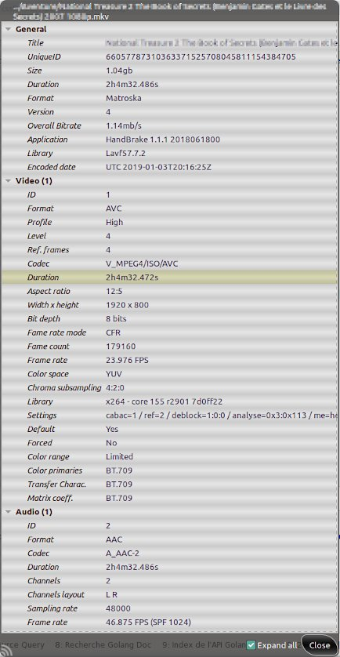

# Info Media mkv Ed

*Simple mkv info viewer with some limited editing features, titling, tag cleaner, default/forced track, head/tail video trimmer, aspect/ratio changer...*

#### Last update 2021-04-06

###### Requirement: *mkvtoolnix, ffmpeg, mediainfo*

```bash
$ sudo apt-get install mkvtoolnix ffmpeg mediainfo
```

Take a look [here, H.F.M repositories](https://github.com/hfmrow/) for other useful linux softwares.

- If you just want to use it, simply download the '*.deb' compiled version under the [releases](https://github.com/hfmrow/info-media-mkv-ed/releases) tab.

- If you want to play inside code, see below "How to compile" section.

## How it's made

- Programmed with go language: [golang](https://golang.org/doc/) 
- GUI provided by [Gotk3 (gtk3 v3.22)](https://github.com/gotk3/gotk3), GUI library for Go (minimum required v3.16).
- I use home-made software: "Gotk3ObjHandler" to embed images/icons, UI-information and manage/generate gtk3 objects code from [glade ui designer](https://glade.gnome.org/).

## Functionalities

**Note**: Edition capabilities are only usable with ***Matroska*** format.

- Display information on media (mediainfo like).
- Allow titling from filename or text file.
- Useless Tag cleaner.
- Set/Change default/forced track.
- Audio delay manipulation.
- Aspect/ratio modifier.
- Head/Tail video trimmer (without re-encoding).
- And more...
- Batch processing.
- Quick view information media (depending on input: 1 file show summary information, more, show file list).
- Drag & Drop functionality.
- Remux function only. Use case, sometimes when the '.mkv' file is not properly multiplexed and cannot be properly inspected to retrieve media information, the file is not accepted (no display in the file list) . Usually when you inspect the media infos , there is no video / audio track available, that's why it is rejected. With '**Remux only**' function *actived*, you can force accepting file, just drop the file(s) in the file list window and press '**Proceed**' to remux. After that you get a new file with the corrected Matroska container.
- Note: due to windows non decoration, left [alt] key restore decoration functionality until button pressed.

## Some pictures

###### File selection window


###### Edit window


###### Info media



###### Overview


## How to compile

- Open terminal window and at command prompt, type: `go get github.com/hfmrow/info-media-mkv-ed`

- See [Gotk3 Installation instructions](https://github.com/gotk3/gotk3/wiki#installation) for gui installation instruction.

- To change gtk3 interface you need to use a home made software, (not published actually). So don't change gtk3 interface (glade file) ...

- To Produce a stand-alone executable, you must change inside "main.go" file:
  
  ```go
    func main() {
        devMode = true
    ...
  ```
  
  into
  
  ```go
    func main() {
        devMode = false
    ...
  ```

This operation indicates that the external data (image/icons) must be integrated into the executable file and/or that the internal behavior will be modified to adapt to the production environment.

### Os informations (build with)

| Name                                                       | Version / Info / Name                          |
| ---------------------------------------------------------- | ---------------------------------------------- |
| GOLANG                                                     | V1.16.3 -> GO111MODULE="off", GOPROXY="direct" |
| DISTRIB                                                    | LinuxMint Xfce                                 |
| VERSION                                                    | 20                                             |
| CODENAME                                                   | ulyana                                         |
| RELEASE                                                    | #46-Ubuntu SMP Fri Jul 10 00:24:02 UTC 2020    |
| UBUNTU_CODENAME                                            | focal                                          |
| KERNEL                                                     | 5.8.0-48-generic                               |
| HDWPLATFORM                                                | x86_64                                         |
| GTK+ 3                                                     | 3.24.20                                        |
| GLIB 2                                                     | 2.64.3                                         |
| CAIRO                                                      | 1.16.0                                         |
| [GtkSourceView](https://github.com/hfmrow/gotk3_gtksource) | 4.6.0                                          |
| [LiteIDE](https://github.com/visualfc/liteide)             | 37.4 qt5.x                                     |
| Qt5                                                        | 5.12.8 in /usr/lib/x86_64-linux-gnu            |

- The compilation have not been tested under Windows or Mac OS.

## You got an issue ?

- Give information (as above), about used platform and OS version.
- Provide a method to reproduce the problem.
